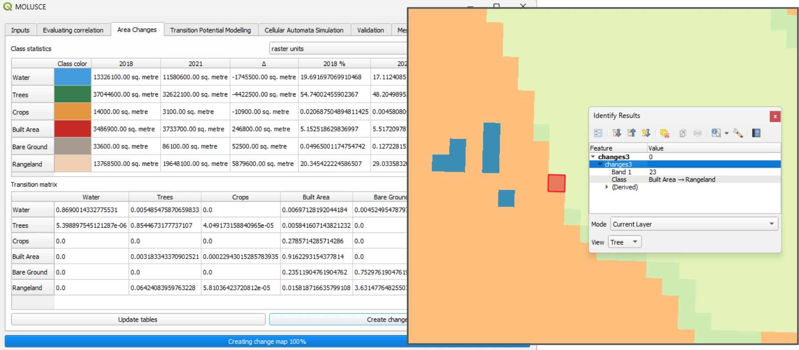
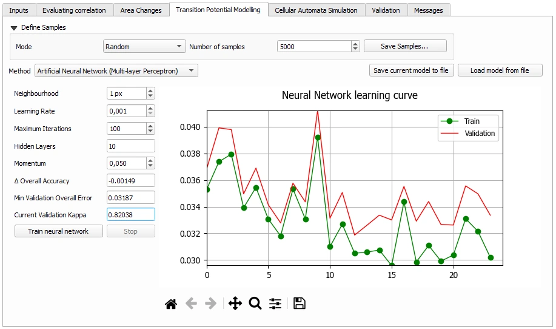
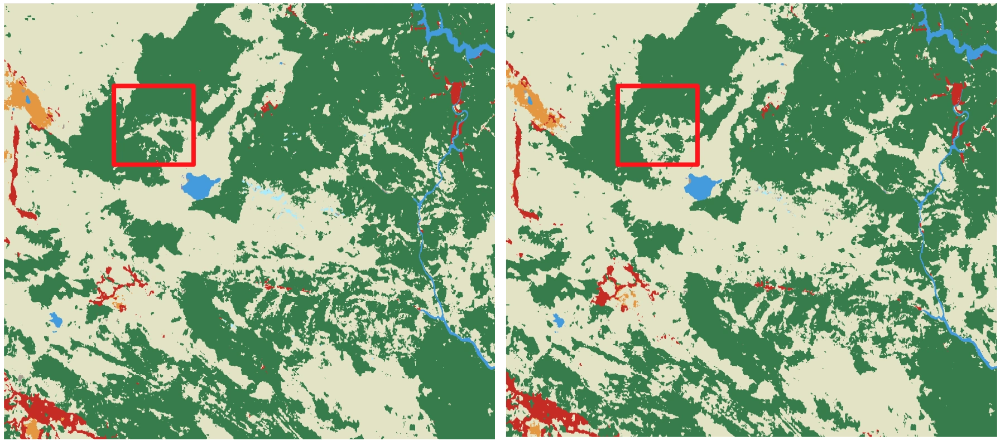
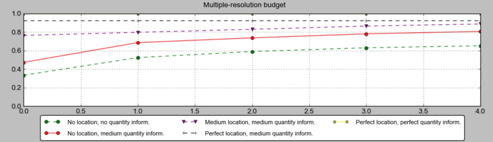
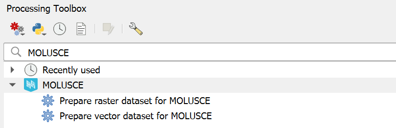

MOLUSCE (Modules for Land Use Change Simulations) is a QGIS plugin for **land use change analysis and prediction**, providing tools for evaluating spatial change dynamics and modeling future land-use scenarios.

Designed for researchers, planners, and GIS analysts, MOLUSCE makes it easy to analyze historical land-use changes and build predictive models. All within QGIS.

## Table of contents

- [Table of contents](#table-of-contents)
- [Key capabilities](#key-capabilities)
  - [Analysis of land use change dynamics](#analysis-of-land-use-change-dynamics)
  - [Predictive Modeling](#predictive-modeling)
  - [Validation](#validation)
  - [Built-in data preparation tools](#built-in-data-preparation-tools)
- [Installation](#installation)
- [Documentation](#documentation)
- [Community](#community)
- [License](#license)

## Key capabilities

### Analysis of land use change dynamics

- **Calculate transition matricies and class statistics**  
  Precise comparison of historical land use raster

- **Build rasters describing the change**  

### Predictive Modeling

- **Build land-use change models using machine learning methods**  
  Using Artificial Neural Networks, Logistic Regression, Weights of Evidence or Milti Criteria Evaluation methods

- **Detailed analysis of model certainty and transition probabilities**

- **Produce maps of predicted change**  

### Validation

- **Built-in mechanism to validate predictive models**

### Built-in data preparation tools

- **QGIS Toolbox tools to prepare raster and vector datasets for MOLUSCE workflows**
  

## Installation

Install **MOLUSCE** from the official QGIS Plugin Repository:

🔍 QGIS → *Plugins* → *Manage and Install Plugins…* → search for **MOLUSCE**

---

## Documentation

📘 [User documentation](https://docs.nextgis.com/docs_ngqgis/source/molusce.html)

📗 [Quick help](https://github.com/nextgis/qgis_molusce/blob/master/src/molusce/doc/en/QuickHelp.pdf)

🎥 Videos:

* [MOLUSCE 4 — LULC change detection and prediction with free QGIS tool. Land Use Change Simulations](https://www.youtube.com/watch?v=F4j1fTyCuy4)

* [MOLUSCE 4 at QGIS Open Day](https://www.youtube.com/watch?v=nFaXCLhQ7qQ)

* [MOLUSCE 5 — New Features: Separate spatial variables for simulation and Model Save/Load](https://www.youtube.com/watch?v=GVrk_uLJbuA)

* [MOLUSCE 5.2 — New Features: Data preparation toolbox tools, Sample points as temporary layer, Qt6](https://www.youtube.com/watch?v=Qyv-_LIxn14)

## Community

- [Community forum](https://community.nextgis.com)
- [GitHub issues and discussionss](https://github.com/nextgis/qgis_molusce/issues)

---

## License

MOLUSCE is licensed under **GNU GPL v2** or any later version
